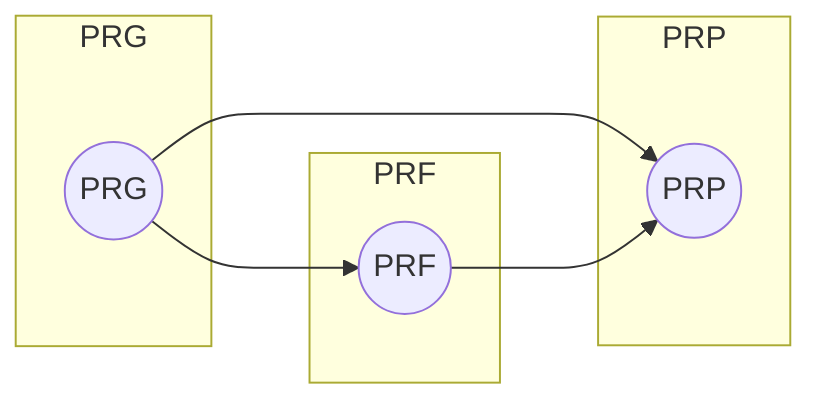

We will delve a little more into the details of PRGs, PRFs and PRPs (Pseudorandom Permutations).

1. PRG (Pseudorandom Generator): This is a deterministic algorithm that takes a short random seed as input and outputs a much longer pseudorandom bit string. The PRG is represented by the node `prg`.

2. PRF (Pseudorandom Function): This is a family of functions that appear indistinguishable from truly random functions. In other words, given a fixed key, the PRF behaves like a random function. The PRF is represented by the node `prf`.

3. PRP (Pseudorandom Permutation): This is a type of PRF that is also a permutation, meaning that for every key, the function is bijective (one-to-one and onto), and there exists an inverse function. The PRP is represented by the node `prp`.

The arrows in the diagram represent the relationships between these cryptographic primitives:

- The PRG can be used to generate random keys or random seeds for the PRF and PRP. It can also expand a short random seed into a longer pseudorandom string to be used as the key for the PRF and PRP.

- The PRF can take a random key generated by the PRG and produce a pseudorandom output that appears as if it were generated by a truly random function.

- The PRP is a special case of the PRF, where the functions are also permutations. This means that the PRP can be used to securely encrypt data in a way that provides confidentiality and integrity, as well as support decryption with the appropriate key.

## Blum-Micali PRG

1. **Setup:**
   - Select two large distinct prime numbers $p$ and $q$, such that $p \equiv q \equiv 3 \, (\text{mod} \, 4)$. These primes satisfy certain properties that make the algorithm secure.
   - Compute the modulus $n = p \times q$.

2. **Key Generation:**
   - Select a random integer $x_0$ between 1 and $n - 1$ as the initial seed.

3. **Pseudorandom Bit Generation:**
   - To generate each pseudorandom bit, repeat the following steps:
     - Compute the next seed as $x_{i+1} = x_i^2 \, \text{mod} \, n$.
     - Extract the least significant bit (LSB) of $x_{i+1}$ and output it as the pseudorandom bit.

The resulting output sequence of bits forms the pseudorandom bitstream. The Blum-Micali PRG has the property that the pseudorandom bits are computationally indistinguishable from true random bits, assuming the quadratic residuosity problem is hard.

The security of the Blum-Micali PRG relies on the hardness of the quadratic residuosity problem, which states that given a large composite number n, finding a square root modulo $n$ is computationally difficult unless you know certain factors of $n$. In the context of Blum-Micali, the composite number $n$ is the product of two large distinct primes $p$ and $q$. Saves us from fast correlation attacks too, pretty neat!

However, there are some considerations when using the Blum-Micali PRG. It is relatively slow compared to other modern PRGs, making it less suitable for applications that require high-speed generation of pseudorandom bits. Additionally, the security of the Blum-Micali PRG can be affected if the prime factors $p$ and $q$ are not selected correctly or if the generator is not used properly. In most modern libraries, construction of the Blum-Micali PRG is almost never used raw. The seed selection also needs to be done carefully. An interesting read for you [here](https://arxiv.org/pdf/2109.12997.pdf) on benchmarking of default compiler PRGs.

## The Goldreich-Goldwasser-Micali (GGM) construction

Let's extend this idea of using hard reverse computability as I like to call it to construct a PRF. The Goldreich-Goldwasser-Micali (GGM) construction is a cryptographic pseudorandom function (PRF) that transforms a one-way function into a PRF. The basic idea is to use the hardness of inverting a one-way function to create a function that behaves like a random function, even though it is efficiently computable. The construction is based on a family of one-way functions and a seed value to derive pseudorandom outputs.

Let's define the GGM construction formally:

1. Let $F: \{0, 1\}^* \times \{0, 1\}^* \rightarrow \{0, 1\}^*$ be a one-way function. It takes two inputs, a key $k$ and a string $x$, and returns an output denoted as $F(k, x)$.

2. Choose a pseudorandom generator (PRG) $G: \{0, 1\}^* \rightarrow \{0, 1\}^{l(n)}$, where $l(n)$ is a polynomial function representing the length of the output.

The GGM construction proceeds as follows:

Step 1: Key Generation

- Generate a random seed $s$ of length $n$, where $n$ is a security parameter.
- The key $k$ used for the GGM construction is the seed $s$.

Step 2: Pseudorandom Function Evaluation

- To evaluate the pseudorandom function $F_{GGM}$ at a point $x \in \{0, 1\}^*$, compute $F_{GGM}(x)$ as follows:

$$
F_{GGM}(x) = G(s \mathbin\| x) \oplus F(s, x)
$$

where $\mathbin\|$ denotes concatenation, and $\oplus$ represents the bitwise XOR operation.

The GGM construction is based on the observation that if $F$ is a one-way function, then the output $F(s, x)$ is indistinguishable from a random string when given $x$ and $s$. Additionally, the output of the PRG $G(s \mathbin\| x)$ is indistinguishable from a random string when given $s$. By XORing these two pseudorandom strings together, we get a new string that is still pseudorandom, as long as the PRG $G$ is secure. This is known as the [hybrid argument](/introduction/hybrid-and-PRF).

The security of the GGM construction relies on the security properties of the one-way function $F$ and the pseudorandom generator $G$. If the one-way function is hard to invert, and the PRG is secure, then the resulting function $F_{GGM}$ is a pseudorandom function, which means it behaves like a random function for any fixed key $k$ (seed $s$) and is computationally indistinguishable from a truly random function.

## IND-CPA encryption

IND CPA stands for "Indistinguishability under Chosen-Plaintext Attack." It is a security property that cryptographic encryption schemes aim to achieve.

Basically, IND CPA means that an adversary should not be able to distinguish between the encryption of two different plaintext messages, even when they are given the power to choose the plaintexts they want to encrypt and observe the corresponding ciphertexts. This ensures that the encryption scheme provides confidentiality and prevents attackers from gaining useful information by analyzing ciphertexts generated from chosen plaintexts. It is a fundamental security requirement for modern encryption schemes.

Best to watch a good video on this [here](https://www.youtube.com/watch?v=qyS8rIQisJk). There's not much textual information I can share with you beyond this, it's best you form a more intuitive understanding of this concept by watching the video. 

In the next topic, I will use analogies to explain CPA and it's "counterpart": CCA (Chosen Ciphertext Attack). From there, you'll gain a better understanding.

[Problem](/problem-set/cpa.md)

## Further Reading
- [How to construct random functions](https://people.csail.mit.edu/silvio/Selected%20Scientific%20Papers/Pseudo%20Randomness/How%20To%20Construct%20Random%20Functions.pdf)
- [Pseudorandom Functions: Three Decades Later](https://eprint.iacr.org/2017/652.pdf)