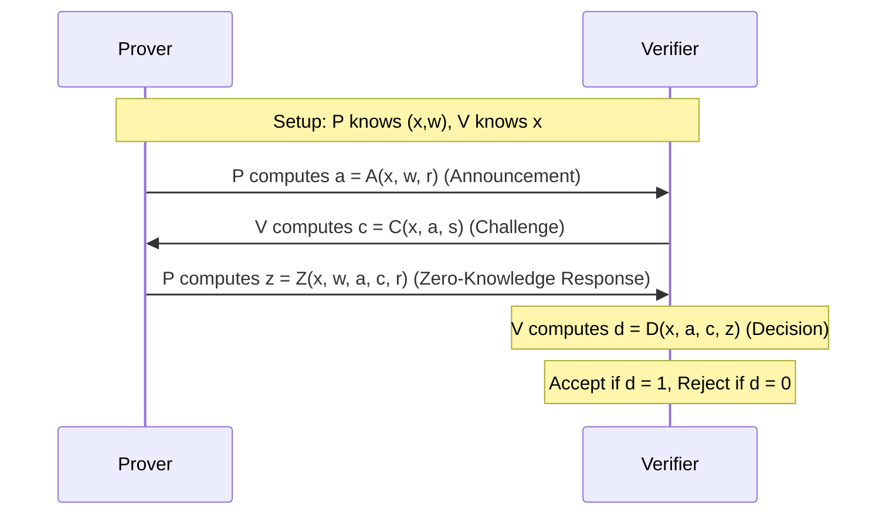

**Setup**:

- Consider a prover $P$ and a verifier $V$.
- A common input $x$ is known to both $P$ and $V$.
- A secret input $w$ (the "witness") is known only to $P$.

**Protocol**:

- $P$ and $V$ interact for $n$ rounds.
- In each round, $P$ sends a message $a$ to $V$, $V$ sends a challenge $c$ to $P$, and $P$ sends a response $z$ to $V$.
- At the end of the interaction, $V$ outputs a decision (Accept or Reject) based on the messages it has received.

Mathematically, this can be modeled as follows:

1. $P$ computes $a = A(x, w, r)$, where $r$ is a random value, and sends $a$ to $V$ - $A$ is the "Announcement" function, used by the Prover to generate an initial message.
2. $V$ computes $c = C(x, a, s)$, where $s$ is a random value, and sends $c$ to $P$ - $C$ is the "Challenge" function, used by the Verifier to create a challenge for the Prover.
3. $P$ computes $z = Z(x, w, a, c, r)$ and sends $z$ to $V$ - $Z$ is the "Zero-Knowledge Response" function, used by the Prover to respond to the Verifier's challenge.
4. $V$ computes $d = D(x, a, c, z)$ and accepts if $d = 1$ and rejects if $d = 0$ - $D$ is the "Decision" function, used by the Verifier to decide whether to accept or reject the Prover's claim.

This protocol satisfies the following properties:

- **Completeness**: If $x, w$ satisfy the relation $R$, then for any $a, c$ computed by $P, V$ according to the protocol, $V$ accepts with high probability.
- **Soundness**: If $x, w$ do not satisfy the relation $R$, then for any $a, c, z$ computed by $P$ and any $a, c$ computed by $V$ according to the protocol, $V$ rejects with high probability.
- **Zero-Knowledgeness**: For any verifier strategy $V^*$, there exists a simulator $S$ such that for any $x, w$ satisfying $R$, the distribution of transcripts between $P, V^*$ is close to the distribution of transcripts between $S, V^*$.

These are the three properties that we want to achieve in a ZKP. The first two are pretty straightforward: if the prover and verifier follow the protocol, then the verifier will accept if the statement is true and reject if the statement is false.

The last point is what makes this a zero-knowledge proof: no matter how $V^*$ behaves, there's a simulator $S$ that can create a transcript that looks just like a real interaction between $P$ and $V^*$, without knowing the secret $w$.

## So why isn't a SHA256 password hash matching scheme a ZKP?

This was a pretty stupid question I had when I first started learning about ZKs. It's not a stupid question, it was intuitive at the time because I didn't truly understand ZKs. But a hashing scheme is not a ZK, a ZKP has certain requirements (outlined above).

1. Interactive Process: ZKPs are typically interactive, involving a series of exchanges between the Prover and Verifier. The Prover doesn't simply present a proof; the Verifier actively participates in the process by sending challenges to the Prover. In the case of password hashing, the process is non-interactive. The user submits a password, it gets hashed, and the hash is compared with the stored value. This is not explicitly outlined, but you'll see why this is important as we go on.

2. Zero-Knowledge Property: In a ZKP, the Verifier learns nothing more than the fact that the statement is true. In the case of password hashing, if the hash function is somehow compromised, or if the hashed passwords are not stored securely, an attacker could learn more than just whether the password is correct or not. They could potentially learn the actual password.

3. Completeness and Soundness: While password hashing does have completeness (if the user provides the correct password, they will be authenticated) and soundness (an incorrect password will not authenticate), these alone do not make it a ZKP.

4. Simulation: A critical aspect of ZKPs is the ability to simulate the Verifier's view without the Prover's secret input. The Verifier's view in a ZKP should be simulatable without knowledge of the Prover's secret. In password hashing, there is no such simulation process.

5. Use of randomness in the challenge: In a ZKP, the Verifier's challenge should be random. In password hashing, the challenge is not random; it is the hash of the password.