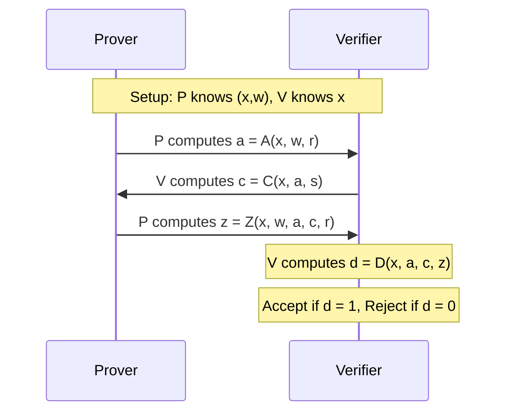

**Setup**:

- Consider a prover $P$ and a verifier $V$.
- A common input $x$ is known to both $P$ and $V$.
- A secret input $w$ (the "witness") is known only to $P$.

**Protocol**:

- $P$ and $V$ interact for $n$ rounds.
- In each round, $P$ sends a message $a$ to $V$, $V$ sends a challenge $c$ to $P$, and $P$ sends a response $z$ to $V$.
- At the end of the interaction, $V$ outputs a decision (Accept or Reject) based on the messages it has received.

Mathematically, this can be modeled as follows:

1. $P$ computes $a = A(x, w, r)$, where $r$ is a random value, and sends $a$ to $V$.
2. $V$ computes $c = C(x, a, s)$, where $s$ is a random value, and sends $c$ to $P$.
3. $P$ computes $z = Z(x, w, a, c, r)$ and sends $z$ to $V$.
4. $V$ computes $d = D(x, a, c, z)$ and accepts if $d = 1$ and rejects if $d = 0$.

This protocol satisfies the following properties:

- **Completeness**: If $x, w$ satisfy the relation $R$, then for any $a, c$ computed by $P, V$ according to the protocol, $V$ accepts with high probability.
- **Soundness**: If $x, w$ do not satisfy the relation $R$, then for any $a, c, z$ computed by $P$ and any $a, c$ computed by $V$ according to the protocol, $V$ rejects with high probability.
- **Zero-Knowledgeness**: For any verifier strategy $V^*$, there exists a simulator $S$ such that for any $x, w$ satisfying $R$, the distribution of transcripts between $P, V^*$ is close to the distribution of transcripts between $S, V^*$.

These are the three properties that we want to achieve in a ZKP. The first two are pretty straightforward: if the prover and verifier follow the protocol, then the verifier will accept if the statement is true and reject if the statement is false.

The last point is what makes this a zero-knowledge proof: no matter how $V^*$ behaves, there's a simulator $S$ that can create a transcript that looks just like a real interaction between $P$ and $V^*$, without knowing the secret $w$.